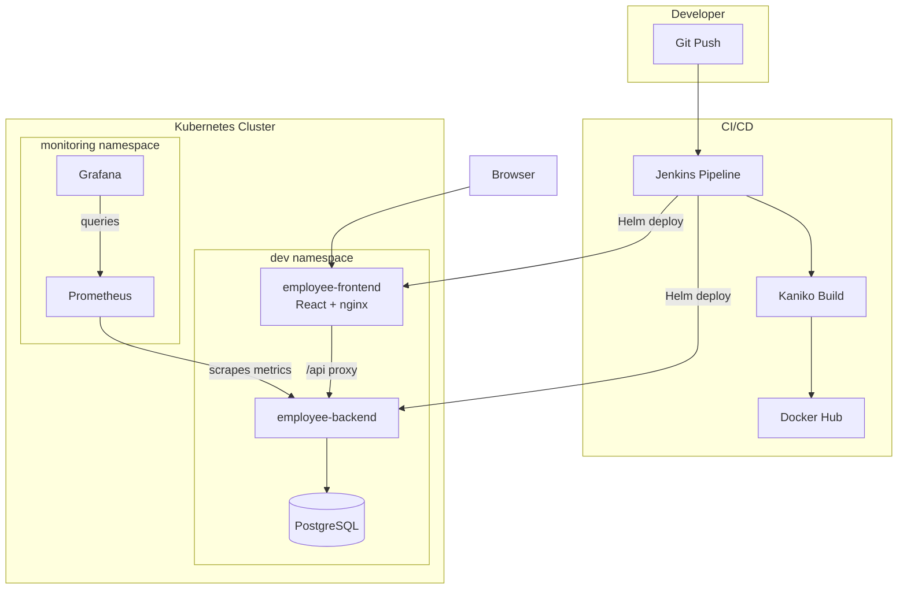

# Employee Management System

A cloud-native employee management application with a React frontend, Node.js REST API, PostgreSQL database, Kubernetes deployments, Jenkins CI/CD, and Prometheus/Grafana monitoring.

## Features

- React UI for viewing and adding employees
- REST API for listing and creating employees
- PostgreSQL persistence
- Dockerized frontend and backend
- Kubernetes manifests for frontend, backend, and Postgres
- Helm chart for parameterized deployments
- Jenkins CI/CD pipeline (build, test, deploy)
- Prometheus and Grafana monitoring stack

## Tech Stack

| Layer         | Technology                        |
| ------------- | --------------------------------- |
| Frontend      | React 19, Vite, nginx             |
| Backend       | Node.js, Express 5                |
| Database      | PostgreSQL 17                     |
| Container     | Docker                            |
| Orchestration | Kubernetes, Helm                  |
| CI/CD         | Jenkins, Kaniko                   |
| Monitoring    | Prometheus, Grafana, Alertmanager |
| Local K8s     | Rancher Desktop                   |

## Quick Start (Rancher Desktop)

Use this when you want the **full stack on local Kubernetes** after cloning the repo.

### 1. Prerequisites

- [Rancher Desktop](https://rancherdesktop.io/) with Kubernetes enabled
- `kubectl`, `helm`, and `docker` on your PATH
- Context set to Rancher Desktop:

```bash
kubectl config use-context rancher-desktop
kubectl get nodes
```

### 2. Build images locally

Rancher Desktop shares images with its embedded Kubernetes, so you do not need to push to Docker Hub for local testing.

```bash
git clone https://github.com/soumya-sitak/employee-management-system.git
cd employee-management-system

docker build -t soumyasitak/employee-backend:local ./backend
docker build -t soumyasitak/employee-frontend:local ./frontend
```

### 3. Deploy the application

```bash
helm upgrade --install employee-management ./helm/employee-management \
  --namespace dev \
  --create-namespace \
  --set backend.image.tag=local \
  --set backend.image.pullPolicy=IfNotPresent \
  --set frontend.image.tag=local \
  --set frontend.image.pullPolicy=IfNotPresent
```

Wait for pods:

```bash
kubectl get pods -n dev -w
```

All five pods should reach `Running` (2 backend, 2 frontend, 1 postgres).

### 4. Create the database table (first time only)

```bash
kubectl wait --for=condition=ready pod -l app=employee-management-postgres -n dev --timeout=120s

POD=$(kubectl get pod -n dev -l app=employee-management-postgres -o jsonpath='{.items[0].metadata.name}')

kubectl exec -n dev "$POD" -- psql -U admin -d employee_db -c "
CREATE TABLE IF NOT EXISTS employees (
  id SERIAL PRIMARY KEY,
  name VARCHAR(255) NOT NULL,
  age INTEGER NOT NULL,
  department VARCHAR(255) NOT NULL
);"
```

### 5. Open the UI

```bash
kubectl port-forward -n dev svc/employee-management-employee-frontend-service 8080:80
```

Open **http://localhost:8080** — add employees in the form and confirm they appear in the table.

### 6. (Optional) Install monitoring

```bash
helm dependency update ./monitoring

helm upgrade --install monitoring ./monitoring \
  --namespace monitoring \
  --create-namespace

kubectl port-forward -n monitoring svc/monitoring-grafana 3000:80
kubectl port-forward -n monitoring svc/monitoring-kube-prometheus-prometheus 9090:9090
```

| Service    | URL                     | Login           |
| ---------- | ----------------------- | --------------- |
| Grafana    | http://localhost:3000   | `admin` / `admin` |
| Prometheus | http://localhost:9090   | —               |

See [monitoring/README.md](monitoring/README.md) for more detail.

## Ports & URLs (cheat sheet)

| What              | URL / command |
| ----------------- | ------------- |
| Frontend (local dev) | http://localhost:5173 |
| Backend (local dev)  | http://localhost:5000 |
| Frontend (K8s port-forward) | `kubectl port-forward -n dev svc/employee-management-employee-frontend-service 8080:80` → http://localhost:8080 |
| Backend (K8s port-forward)  | `kubectl port-forward -n dev svc/employee-management-employee-backend-service 5000:5000` → http://localhost:5000 |
| Jenkins           | `kubectl port-forward -n jenkins svc/jenkins 8081:8080` → http://localhost:8081 |
| Grafana           | `kubectl port-forward -n monitoring svc/monitoring-grafana 3000:80` → http://localhost:3000 |
| Prometheus        | `kubectl port-forward -n monitoring svc/monitoring-kube-prometheus-prometheus 9090:9090` → http://localhost:9090 |

## Architecture



The frontend nginx container reverse-proxies `/api/*` to the backend (`BACKEND_HOST` / `BACKEND_PORT` env vars). The same image works in Docker, raw Kubernetes manifests, and Helm without rebuilding.

## Project Structure

```
employee-management-system/
├── frontend/                # React (Vite) UI + nginx Dockerfile
├── backend/                 # Express REST API
├── helm/employee-management # Application Helm chart
├── k8s/                     # Raw Kubernetes manifests
│   ├── frontend/
│   ├── backend/
│   ├── config/
│   ├── jenkins/
│   └── postgres/
├── jenkins/                 # Jenkins Helm chart
├── monitoring/              # Prometheus + Grafana Helm chart
└── Jenkinsfile              # CI/CD pipeline
```

## Local Development (without Kubernetes)

Run backend and frontend on your machine for fast iteration.

### Terminal 1 — Backend

```bash
cd backend
npm install
cp .env.example .env   # edit DB credentials
npm start
```

API: http://localhost:5000

Create the `employees` table in PostgreSQL (once):

```sql
CREATE TABLE IF NOT EXISTS employees (
  id SERIAL PRIMARY KEY,
  name VARCHAR(255) NOT NULL,
  age INTEGER NOT NULL,
  department VARCHAR(255) NOT NULL
);
```

### Terminal 2 — Frontend

```bash
cd frontend
npm install
npm run dev
```

UI: http://localhost:5173 (Vite proxies `/api/*` → `http://localhost:5000`)

### Verify

```bash
curl http://localhost:5000/employees
curl -X POST http://localhost:5000/employees \
  -H "Content-Type: application/json" \
  -d '{"name": "Jane Doe", "age": 30, "department": "Engineering"}'
```

## API Endpoints

| Method | Endpoint     | Description              |
| ------ | ------------ | ------------------------ |
| GET    | `/`          | Health check message     |
| GET    | `/db-test`   | Test database connection |
| GET    | `/employees` | List all employees       |
| POST   | `/employees` | Create a new employee    |

**POST body:** `{ "name": "Jane Doe", "age": 30, "department": "Engineering" }`

## Docker

**Backend:**

```bash
cd backend
docker build -t soumyasitak/employee-backend:latest .
docker run -p 5000:5000 --env-file .env soumyasitak/employee-backend:latest
```

**Frontend** (needs a running backend):

```bash
cd frontend
docker build -t soumyasitak/employee-frontend:latest .
docker run -p 8080:80 \
  -e BACKEND_HOST=host.docker.internal \
  -e BACKEND_PORT=5000 \
  soumyasitak/employee-frontend:latest
```

Open http://localhost:8080

## Kubernetes (raw manifests)

```bash
kubectl apply -f k8s/config/
kubectl apply -f k8s/postgres/
kubectl apply -f k8s/backend/
kubectl apply -f k8s/frontend/
```

Create the `employees` table (see [Quick Start step 4](#4-create-the-database-table-first-time-only)) using pod label `app=postgres` and service `postgres-service` if not using Helm.

```bash
kubectl port-forward svc/frontend-service 8080:80
```

> Update credentials in `k8s/config/*-secret.yaml` before production use.

## Helm Deployment

Default install (pulls images from Docker Hub):

```bash
helm upgrade --install employee-management ./helm/employee-management \
  --namespace dev \
  --create-namespace
```

Key values in `helm/employee-management/values.yaml`:

```yaml
backend:
  replicaCount: 2
  image:
    repository: soumyasitak/employee-backend
    tag: latest
    pullPolicy: Always

frontend:
  replicaCount: 2
  image:
    repository: soumyasitak/employee-frontend
    tag: latest
    pullPolicy: Always
```

For **local images** on Rancher Desktop, use `tag: local` and `pullPolicy: IfNotPresent` (see [Quick Start](#quick-start-rancher-desktop)).

## CI/CD (Jenkins)

### One-time setup

```bash
kubectl apply -f k8s/jenkins/jenkins-deployer-rbac.yaml
```

Install Jenkins from `./jenkins` (see [jenkins/README.md](jenkins/README.md)).

### Jenkins credentials

| ID                     | Purpose              |
| ---------------------- | -------------------- |
| `github-pat`           | Git checkout         |
| `dockerhub-credentials`| Push backend + frontend images |

### Pipeline flow

1. Backend: `npm ci`, `npm test`
2. Frontend: `npm ci`, `npm run build`
3. Kaniko: build and push **both** images to Docker Hub
4. `helm lint` and deploy to `dev` (on `master` only)
5. Ensure `employees` table exists
6. Verify backend and frontend rollouts

### Access Jenkins

```bash
kubectl port-forward -n jenkins svc/jenkins 8081:8080
```

Open http://localhost:8081

### After deploy

```bash
kubectl get pods -n dev
kubectl port-forward -n dev svc/employee-management-employee-frontend-service 8080:80
```

## Monitoring

```bash
helm dependency update ./monitoring
helm upgrade --install monitoring ./monitoring -n monitoring --create-namespace
```

Details: [monitoring/README.md](monitoring/README.md)

## Demo Walkthrough (presentation)

1. Architecture diagram (above)
2. UI at http://localhost:8080 — add an employee live
3. `kubectl get pods -n dev` and `-n monitoring`
4. Jenkins pipeline (both images)
5. Grafana dashboards + `up` in Explore
6. Prometheus **Status → Targets**

## Environment Variables

### Backend

| Variable      | Description     | Example       |
| ------------- | --------------- | ------------- |
| `DB_HOST`     | PostgreSQL host | `localhost`   |
| `DB_PORT`     | PostgreSQL port | `5432`        |
| `DB_USER`     | Database user   | `admin`       |
| `DB_PASSWORD` | Password        | (from secret) |
| `DB_NAME`     | Database name   | `employee_db` |

### Frontend (container)

| Variable       | Description              | Default (raw k8s)   |
| -------------- | ------------------------ | ------------------- |
| `BACKEND_HOST` | Backend service hostname | `backend-service`   |
| `BACKEND_PORT` | Backend port             | `5000`              |

Helm sets these automatically via `frontend-config` ConfigMap.

## Troubleshooting

| Problem | Fix |
| ------- | --- |
| `ImagePullBackOff` on Rancher Desktop | Build images locally and set `pullPolicy: IfNotPresent` + `tag: local` |
| Empty employee list / API errors | Run the `CREATE TABLE` SQL on Postgres (Quick Start step 4) |
| Frontend shows data in UI but Grafana empty | Use internal service URL in Grafana datasource: `http://monitoring-kube-prometheus-prometheus:9090` |
| `connection refused` on port-forward | Start Rancher Desktop; wait until `kubectl get nodes` shows `Ready` |
| Local dev: frontend cannot reach API | Start backend on port 5000 first; Vite proxies `/api` automatically |

## Roadmap

- [x] Frontend UI (React + Vite)
- [x] CI/CD pipeline (Jenkins)
- [x] Monitoring stack (Prometheus + Grafana)
- [ ] Application metrics (`/metrics` on backend)
- [ ] Ingress and TLS
- [x] Unit tests (backend health check)

## License

ISC
