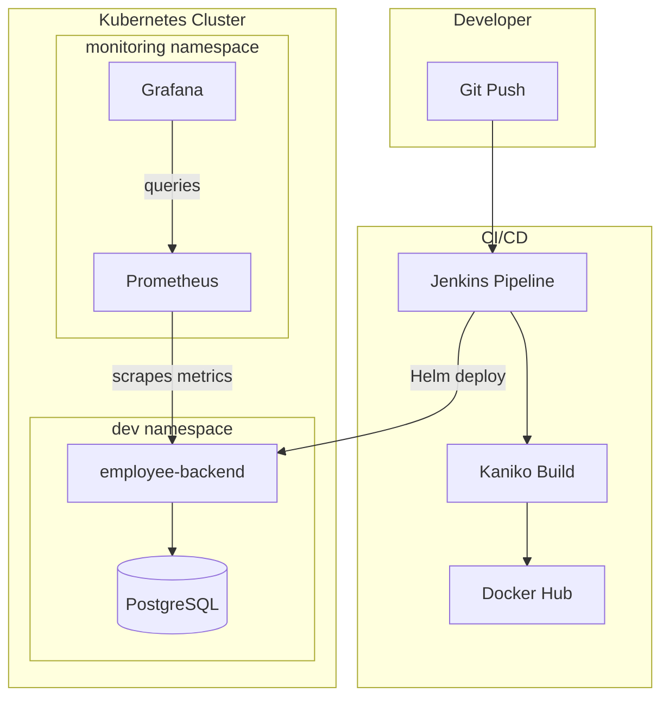

# Employee Management System

A cloud-native employee management application with a Node.js REST API, PostgreSQL database, Kubernetes deployments, Jenkins CI/CD, and Prometheus/Grafana monitoring.

## Features

- REST API for listing and creating employees
- PostgreSQL persistence
- Dockerized backend
- Kubernetes manifests for backend and Postgres
- Helm chart for parameterized deployments
- Jenkins CI/CD pipeline (build, test, deploy)
- Prometheus and Grafana monitoring stack

## Tech Stack

| Layer         | Technology                        |
| ------------- | --------------------------------- |
| Backend       | Node.js, Express 5                |
| Database      | PostgreSQL 17                     |
| Container     | Docker                            |
| Orchestration | Kubernetes, Helm                  |
| CI/CD         | Jenkins, Kaniko                   |
| Monitoring    | Prometheus, Grafana, Alertmanager |
| Local K8s     | Rancher Desktop                   |

## Architecture



## Project Structure

```
employee-management-system/
├── backend/                 # Express REST API
│   ├── app.js
│   ├── app.test.js
│   ├── db.js
│   ├── routes/
│   └── Dockerfile
├── helm/employee-management # Application Helm chart
├── k8s/                     # Raw Kubernetes manifests
│   ├── backend/
│   ├── config/
│   ├── jenkins/             # Jenkins deployer RBAC
│   └── postgres/
├── jenkins/                 # Jenkins Helm chart
├── monitoring/              # Prometheus + Grafana Helm chart
├── Jenkinsfile              # CI/CD pipeline
└── frontend/                # UI (planned)
```

## Prerequisites

- Node.js 18+ (22 recommended for Docker)
- npm
- PostgreSQL 17 (local or container)
- Docker (optional, for container builds)
- kubectl and Helm 3 (for Kubernetes deployment)
- Rancher Desktop (recommended for local Kubernetes)

## Local Development

### 1. Install dependencies

```bash
cd backend
npm install
```

### 2. Configure environment

Copy the example env file and edit credentials:

```bash
cp backend/.env.example backend/.env
```

### 3. Set up the database

Connect to PostgreSQL and run:

```sql
CREATE TABLE IF NOT EXISTS employees (
  id SERIAL PRIMARY KEY,
  name VARCHAR(255) NOT NULL,
  age INTEGER NOT NULL,
  department VARCHAR(255) NOT NULL
);
```

### 4. Start the server

```bash
npm start
```

The API runs at `http://localhost:5000`.

### Verify

```bash
curl http://localhost:5000/
curl http://localhost:5000/db-test
curl http://localhost:5000/employees
```

## API Endpoints

| Method | Endpoint      | Description              |
| ------ | ------------- | ------------------------ |
| GET    | `/`           | Health check message     |
| GET    | `/db-test`    | Test database connection |
| GET    | `/employees`  | List all employees       |
| POST   | `/employees`  | Create a new employee    |

### Create an employee

```bash
curl -X POST http://localhost:5000/employees \
  -H "Content-Type: application/json" \
  -d '{"name": "Jane Doe", "age": 30, "department": "Engineering"}'
```

**Request body:**

```json
{
  "name": "Jane Doe",
  "age": 30,
  "department": "Engineering"
}
```

**Response (201):**

```json
{
  "id": 1,
  "name": "Jane Doe",
  "age": 30,
  "department": "Engineering"
}
```

## Docker

Build and run the backend image from the `backend` directory:

```bash
cd backend
docker build -t employee-backend:latest .
docker run -p 5000:5000 --env-file .env employee-backend:latest
```

## Kubernetes Deployment

Deploy Postgres and the backend using the raw manifests in `k8s/`:

```bash
kubectl apply -f k8s/config/
kubectl apply -f k8s/postgres/
kubectl apply -f k8s/backend/
```

Check status:

```bash
kubectl get pods
kubectl get svc
```

> **Note:** Update credentials in `k8s/config/*-secret.yaml` before deploying to production. Do not use default passwords in live environments.

## Helm Deployment

Install or upgrade the application with Helm:

```bash
helm upgrade --install employee-management ./helm/employee-management
```

Customize replicas, image tag, or Postgres storage in `helm/employee-management/values.yaml`:

```yaml
backend:
  replicaCount: 2
  image:
    repository: soumyasitak/employee-backend
    tag: latest

postgres:
  storage:
    size: 1Gi
  image:
    tag: "17"
```

Deploy to a specific namespace:

```bash
helm upgrade --install employee-management ./helm/employee-management \
  --namespace dev \
  --create-namespace
```

## CI/CD (Jenkins)

### One-time cluster setup

```bash
kubectl apply -f k8s/jenkins/jenkins-deployer-rbac.yaml
kubectl get sa jenkins-deployer -n jenkins
```

### Access Jenkins

Retrieve the admin credentials from the cluster (do not store passwords in this repo):

```bash
# Username
kubectl get secret jenkins -n jenkins -o jsonpath="{.data.jenkins-admin-user}" | base64 -d && echo

# Password
kubectl get secret jenkins -n jenkins -o jsonpath="{.data.jenkins-admin-password}" | base64 -d && echo
```

**Local access** (from a machine with `kubectl` configured):

```bash
kubectl port-forward -n jenkins svc/jenkins 8081:8080
```

Open `http://localhost:8081` in your browser.

**Remote access via SSH tunnel** (e.g. Jenkins runs on a Windows host; forward from your laptop):

```bash
# Interactive session with port forward
ssh -L 8080:localhost:8080 user@windows-host

# Background tunnel only (no remote shell)
ssh -N -L 8080:localhost:8080 user@windows-host
```

Then open `http://localhost:8080`. Replace `user@windows-host` with your SSH user and host.

> **Security:** Store GitHub PAT and Docker Hub credentials only in Jenkins (**Manage Jenkins → Credentials**), never in `README.md` or git. If a token was exposed, revoke it in GitHub and create a new one.

### Jenkins credentials required

| ID | Type | Purpose |
| ---- | ------ | --------- |
| `github-pat` | Username/password or secret text | Git checkout |
| `dockerhub-credentials` | Username/password | Push Docker image |

### Pipeline flow

1. `npm ci` and `npm test`
2. Build and push image to Docker Hub (`BUILD_NUMBER` and `GIT_COMMIT` tags)
3. `helm lint`
4. Deploy to `dev` namespace (only on `master` branch)
5. Ensure `employees` table exists (non-destructive; preserves existing data)
6. Verify rollout with `kubectl rollout status`

### Trigger a deploy

Push to `master` — Jenkins runs the pipeline from `Jenkinsfile`.

Configure a **Pipeline** job with **Pipeline script from SCM**, branch `master`, script path `Jenkinsfile`. Ensure agent pods run in the `jenkins` namespace (where `jenkins-deployer` ServiceAccount exists).

### Verify after deploy

```bash
kubectl get pods -n dev
kubectl port-forward -n dev svc/employee-management-employee-backend-service 5000:5000
curl http://localhost:5000/
curl http://localhost:5000/employees
```

> **Note:** Postgres data is stored on a PVC and is never deleted by the pipeline. If the `employees` table is missing, the pipeline creates it with `CREATE TABLE IF NOT EXISTS` without affecting existing rows.

## Monitoring (Prometheus + Grafana)

### One-time setup

```bash
helm dependency update ./monitoring
helm upgrade --install monitoring ./monitoring \
  --namespace monitoring \
  --create-namespace
```

### Access Grafana and Prometheus

```bash
# Grafana (http://localhost:3000 — admin / admin)
kubectl port-forward -n monitoring svc/monitoring-grafana 3000:80

# Prometheus (http://localhost:9090)
kubectl port-forward -n monitoring svc/monitoring-kube-prometheus-prometheus 9090:9090
```

In Grafana: **Dashboards → Browse** → open a Kubernetes dashboard, or use **Explore** with:

```promql
up
count(kube_pod_info) by (namespace)
```

See [monitoring/README.md](monitoring/README.md) for full configuration and uninstall steps.

## Demo Walkthrough

Suggested order for a live presentation:

1. **Architecture** — walk through the diagram above (app, CI/CD, monitoring)
2. **API** — `curl http://localhost:5000/employees` or port-forward the deployed backend
3. **Kubernetes** — `kubectl get pods -n dev` and `kubectl get pods -n monitoring`
4. **Jenkins** — show pipeline stages (test → build → deploy)
5. **Grafana** — open Kubernetes dashboards and run `up` in Explore
6. **Prometheus** — show **Status → Targets** to demonstrate metric scraping

## Environment Variables

| Variable      | Description           | Example            |
| ------------- | --------------------- | ------------------ |
| `DB_HOST`     | PostgreSQL host       | `localhost`        |
| `DB_PORT`     | PostgreSQL port       | `5432`             |
| `DB_USER`     | Database user         | `admin`            |
| `DB_PASSWORD` | Database password     | (set via secret)   |
| `DB_NAME`     | Database name         | `employee_db`      |

## Roadmap

- [ ] Frontend UI
- [x] CI/CD pipeline (Jenkins)
- [x] Monitoring stack (Prometheus + Grafana)
- [ ] Application metrics (`/metrics` endpoint on backend)
- [ ] Ingress and TLS
- [x] Unit tests (backend health check)

## License

ISC
